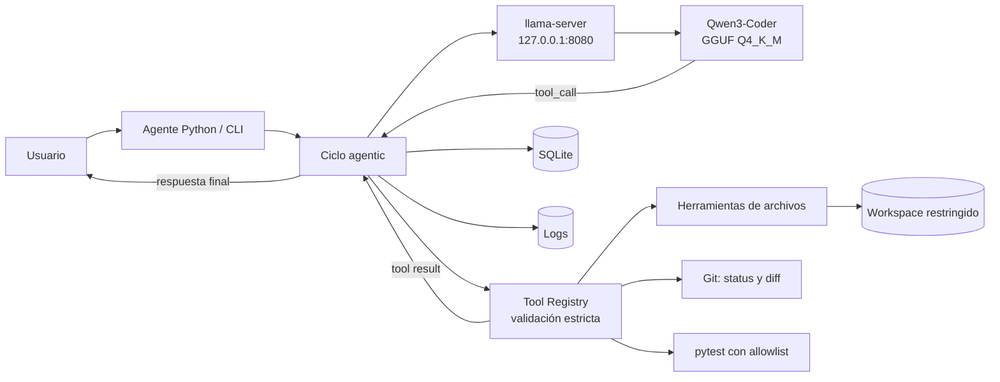

# Agente de IA Local con Qwen3-Coder y llama.cpp


Agente de programación y administración técnica que se ejecuta completamente en una VM Ubuntu Server, sin depender de una API de inferencia en la nube. Integra **Qwen3-Coder 30B**, `llama.cpp` y un agente Python capaz de solicitar herramientas reales, validar cada operación y devolver sus resultados al modelo antes de responder.

El proyecto demuestra cómo convertir un LLM local en un sistema útil y controlado: inferencia CPU-only, tool calling nativo, aislamiento del workspace, memoria SQLite, pruebas automatizadas y operación persistente con systemd y privilegios mínimos.

**Autor:** [Marlon-Castillo-F](https://github.com/Marlon-Castillo-F)

## Características principales

- Tool calling real mediante el formato compatible con OpenAI de `llama-server`.
- Modelo GGUF local; no se envían conversaciones a una API de inferencia externa.
- Herramientas seguras para archivos, consultas Git y ejecución controlada de pytest.
- Workspace restringido con protección contra path traversal y escapes por symlink.
- Memoria de sesiones en SQLite y logging rotativo.
- Allowlist de comandos, validación estricta de argumentos y timeouts.
- `llama-server` administrado por systemd bajo un usuario sin shell y no-root.
- API limitada a `127.0.0.1:8080`.
- **32 pruebas aprobadas y 0 fallidas**, incluidas pruebas end-to-end con el modelo real.

## Arquitectura



El modelo nunca ejecuta código directamente: solo propone una llamada estructurada. Python decide si la herramienta y sus argumentos están permitidos, ejecuta el handler registrado y devuelve el resultado real. Consulta [Arquitectura](docs/arquitectura.md) y [Tool calling](docs/tool-calling.md).

## Stack tecnológico

| Capa | Tecnología |
|---|---|
| Virtualización y SO | VMware ESXi, Ubuntu Server 24.04 LTS |
| Agente | Python 3.12, Requests |
| Modelo | Qwen3-Coder-30B-A3B-Instruct, GGUF Q4_K_M |
| Inferencia | llama.cpp |
| Persistencia | SQLite |
| Operación | systemd, Git |
| Validación | pytest |

## Hardware del laboratorio

La implementación validada corre en una **VM CPU-only**:

- 24 vCPU sobre Intel Xeon E5-2699 v4.
- 39 GiB de RAM y 8 GiB de swap.
- Sin GPU de cómputo.

Esta es la configuración del laboratorio, no un requisito rígido. Otros equipos pueden ejecutar el proyecto ajustando modelo, cuantización, contexto y threads a sus recursos.

## Modelo

- **Modelo:** Qwen3-Coder-30B-A3B-Instruct.
- **Cuantización:** Q4_K_M.
- **Formato:** GGUF.
- **Referencia usada:** `lmstudio-community/Qwen3-Coder-30B-A3B-Instruct-GGUF:Q4_K_M`.

Se eligió un modelo orientado a código y una cuantización que permite ejecutar aproximadamente 30 mil millones de parámetros en el servidor CPU-only disponible. El archivo GGUF se administra por separado y está excluido de Git.

## Tool calling real

```text
Usuario → Qwen → tool_call → validación Python → ejecución
        → tool result → Qwen → respuesta final
```

Ejemplo validado después de reiniciar el servidor:

```text
Tú> qué archivos tienes disponibles en tu workspace

[tool] list_files
[tool result]
[DIR] proyecto-demo
[FILE] prueba.txt

IA> En el workspace están disponibles el directorio proyecto-demo
    y el archivo prueba.txt.
```

La respuesta solo se acepta cuando existe un `tool_call` estructurado y el resultado procede del handler Python; no se interpreta texto del modelo como una ejecución.

## Seguridad

- Agente y servidor de inferencia ejecutados sin root.
- Servicio dedicado `llama` sin shell interactivo.
- API enlazada exclusivamente a localhost.
- Herramientas registradas explícitamente; no existe ejecución arbitraria por nombre.
- Bloqueo de rutas absolutas, path traversal, symlinks y archivos binarios cuando corresponde.
- Lecturas y escrituras con límite de tamaño; `write_file` solo opera dentro del workspace.
- `run_tests` utiliza argumentos en lista, allowlist, timeout y nunca `shell=True`.
- Censura heurística de secretos antes de persistir memoria SQLite.

Más detalles en [Seguridad](docs/seguridad.md).

## Benchmarks CPU

Mediciones realizadas en la VM del laboratorio:

| Configuración | Prompt | Generación |
|---|---:|---:|
| 12 threads | ≈ 21,5 tok/s | ≈ 10,1 tok/s |
| 18 threads | ≈ 23,7 tok/s | ≈ 10,3 tok/s |
| 24 threads | **≈ 27,4 tok/s** | ≈ 10,2 tok/s |
| 24 threads + NUMA distribute | ≈ 14,4 tok/s | ≈ 10,4 tok/s |

La configuración final usa **24 threads sin NUMA distribute**: ofreció el mejor procesamiento de contexto sin una diferencia material en generación. Consulta [Benchmarks](docs/benchmarks.md).

## Pruebas

```text
32 passed in 13.54s
0 failed
```

La suite cubre archivos, seguridad de rutas, symlinks, límites, herramientas no autorizadas, validación de argumentos, timeouts, SQLite, Git, CLI, conexión al servidor y dos ciclos end-to-end reales (`list_files` y `read_file`).

```bash
python -m pytest -q

# Incluye las pruebas contra un llama-server local ya iniciado
RUN_LIVE_E2E=1 python -m pytest -q
```

Detalles y ejecuciones registradas en [Pruebas](docs/pruebas.md).

## Instalación

### Requisitos generales

- Linux x86-64 con recursos suficientes para el modelo seleccionado.
- Python 3.12 o compatible.
- `llama.cpp` compilado y un modelo GGUF descargado por separado.
- Git.

### Agente Python

El repositorio aún no tiene remoto. Sustituye el placeholder cuando exista una URL pública:

```bash
git clone <URL_DEL_REPOSITORIO>
cd ai-agent
python3 -m venv .venv
source .venv/bin/activate
python -m pip install -r requirements.txt
python -m pytest -q
```

El modelo **no forma parte del repositorio**. La unidad de ejemplo está en `deploy/llama-server.service` y debe adaptarse a las rutas y recursos de cada sistema. Consulta [Instalación](docs/instalacion.md).

## Uso

Instalación validada en el laboratorio:

```bash
cd /home/soporte/ai-agent
source .venv/bin/activate
python -m app.main
```

### Comandos del agente

| Comando | Función |
|---|---|
| `/info` | Consulta configuración y estado real de `/v1/models` |
| `/help` | Muestra la ayuda disponible |
| `/history` | Presenta el historial de la sesión actual |
| `/clear` | Inicia una sesión limpia y reduce el contexto enviado |
| `/exit` | Cierra el cliente interactivo |

### Herramientas registradas

`list_files`, `read_file`, `write_file`, `git_status`, `git_diff` y `run_tests`.

## Estructura del proyecto

```text
ai-agent/
├── app/
│   ├── agent.py
│   ├── client.py
│   ├── config.py
│   ├── main.py
│   ├── memory.py
│   └── tools/
├── deploy/
│   └── llama-server.service
├── docs/
├── tests/
├── workspace/
├── requirements.txt
└── README.md
```

## Problemas encontrados y decisiones

- El prototipo no enviaba `tools` ni procesaba `tool_calls`, aunque Qwen y llama.cpp sí eran compatibles.
- Un system prompt explícito y `/info` basado en la API corrigieron una identificación errónea del modelo.
- `--numa distribute` redujo casi a la mitad la velocidad de prompt y fue descartado.
- El runtime se sacó de `/root` y el servicio final utiliza privilegios mínimos.
- Después de un reboot, la carga CPU-only del modelo tarda aproximadamente **1 minuto 45 segundos**; systemd permanece activo durante ese proceso.

Consulta [Decisiones técnicas](docs/decisiones.md) y [Problemas encontrados](docs/problemas-encontrados.md).

## Limitaciones

- Qwen sigue siendo un modelo generativo y puede producir respuestas incorrectas.
- La ejecución CPU-only limita la velocidad y aumenta el tiempo inicial de carga.
- La censura de secretos es heurística, no una garantía absoluta.
- El servicio está diseñado para uso local; no debe exponerse directamente a Internet ni presentarse como plataforma enterprise sin una revisión adicional de autenticación, aislamiento y observabilidad.
- La memoria actual es conversacional y no implementa búsqueda semántica ni RAG.

## Roadmap — no implementado

- RAG sobre documentos locales.
- Integración opcional con Obsidian.
- Nuevas herramientas controladas.
- Interfaz web.
- Observabilidad y evaluaciones automáticas ampliadas.
- Workspaces para múltiples proyectos.
- Estrategias de memoria más avanzadas.

## Aprendizajes

El proyecto integra administración Linux, inferencia local de LLMs, formatos GGUF, diseño de ciclos agentic, seguridad de herramientas, systemd, pruebas automatizadas y optimización empírica en hardware CPU-only. El foco no fue entrenar un modelo ni desarrollar llama.cpp, sino **integrar, configurar, asegurar y validar** esas piezas como un sistema reproducible.

Material para presentar el proyecto: [Resumen de portafolio](docs/portfolio-summary.md) y [Preguntas de entrevista](docs/interview-questions.md).
