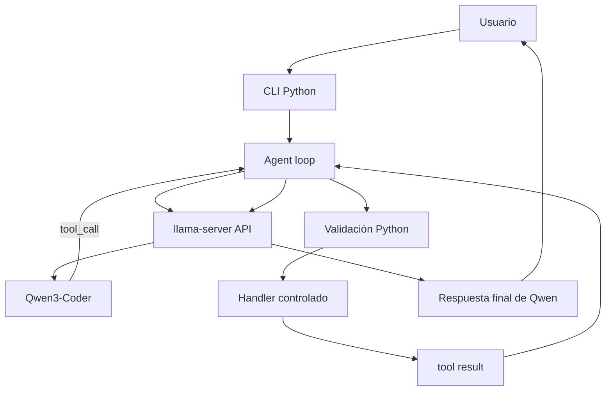
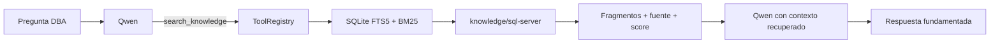

# Guía de Estudio - Qwen3 Local AI Agent DBA Edition

Esta guía explica el proyecto para estudiarlo, defender sus decisiones técnicas y recrear un sistema semejante. No sustituye al README: relaciona conceptos con el código real, los errores encontrados y la evidencia de pruebas.

## 1 Introducción

**HECHO DEL PROYECTO.** El objetivo fue convertir un modelo local en un asistente útil que pudiera conversar, solicitar acciones estructuradas y trabajar dentro de límites verificables. La versión 1.0 resolvió el ciclo general de agente; la versión 1.1 añadió especialización en SQL Server sin cambiar los pesos del modelo.

Se eligió inferencia local para conservar control sobre el runtime, los datos, el puerto y los recursos, y para no depender de una API de inferencia externa. Qwen3-Coder se eligió por su orientación a código. `llama.cpp` carga el GGUF y publica una API compatible con OpenAI que soporta chat y tool calling. La máquina de laboratorio es CPU-only: la inferencia se realiza con CPU y memoria del sistema, sin GPU de cómputo. Esto reduce requisitos especializados, pero aumenta la latencia.

**CONCEPTO. LLM no es igual a agente.** El LLM predice tokens y propone respuestas o `tool_calls`. No valida permisos, no abre archivos por sí solo y no constituye una frontera de seguridad. El agente Python añade:

- el cliente HTTP y el agent loop;
- las definiciones y ejecución de herramientas;
- validación, allowlists y aislamiento del workspace;
- memoria SQLite y contexto conversacional;
- RAG sobre una base de conocimiento local;
- logging, CLI y comandos deterministas;
- pruebas unitarias, E2E y evaluaciones de dominio.

Una forma de recordarlo es: **Qwen razona y propone; Python autoriza y ejecuta; llama.cpp sirve la inferencia**.

## 2 Evolución del proyecto

**HECHO DEL PROYECTO.** El historial Git demuestra desarrollo incremental:

| Commit | Etapa | Aporte |
|---|---|---|
| `41a2465` | Captura inicial | Conservó el prototipo preexistente antes de reemplazarlo. |
| `f3dc0d2` | v1.0 funcional | Implementó tool calling nativo, seguridad, memoria, logging y tests. |
| `f958197` | Operación | Documentó el agente validado y el servicio de inferencia. |
| `1cfc93c` | Arranque | Registró la validación posterior al reboot. |
| `dfc280b` | Presentación | Mejoró README y material de portafolio. |
| `9b005a7` | Baseline DBA | Guardó las 23 respuestas reales previas a especializar. |
| `dc5f98b` | RAG | Añadió corpus SQL Server y retrieval SQLite FTS5. |
| `2fe09e3` | Tools DBA | Añadió cuatro parsers offline y muestras sintéticas. |
| `43832df` | Evaluación | Añadió runner, comparador y tests DBA. |
| `1615dee` | Corrección de razonamiento | Reforzó interpretación basada en evidencia. |
| `78a89c4` | Selección de tools | Indicó que no se deben inventar rutas de artefactos. |
| `ee5e612` | Gate en Python | Ocultó analizadores de archivos cuando el usuario no aporta una extensión compatible. |
| `3f08a55` | Retrieval en español | Normalizó acentos y expandió términos DBA español-inglés. |
| `1fbafe1` | Resultado final | Preservó la evaluación definitiva y su comparación con el baseline. |
| `dd87454` | Documentación final | Registró métricas, ejemplos, arquitectura, seguridad y límites de DBA Edition. |

La v1.0 estableció la plataforma: cliente, tool calling, workspace, memoria, logging, pruebas, systemd y controles. La v1.1 siguió el orden correcto para medir un cambio: baseline antes de modificar el comportamiento, prompt especializado, conocimiento recuperable, herramientas, evaluación posterior y correcciones derivadas de fallos observados.

Los commits de resultados finales, documentación y esta guía se añaden después de validar sus datos. Así se evita un único commit gigante y se puede explicar qué hipótesis motivó cada cambio.

## 3 Arquitectura completa

### Flujo general



1. `app/main.py` recibe el texto y atiende comandos locales como `/info` o `/knowledge` sin preguntarle al LLM.
2. `Agent.run()` agrega el mensaje a la sesión y envía `messages` y las herramientas disponibles.
3. `app/client.py` hace `POST /v1/chat/completions` a llama-server.
4. Qwen puede devolver texto o uno o varios `tool_calls` estructurados.
5. `ToolRegistry` verifica nombre, JSON, campos y tipos. El handler aplica controles adicionales.
6. El resultado real entra al historial con `role=tool` y el mismo `tool_call_id`.
7. Qwen recibe la evidencia y redacta la respuesta final. El ciclo admite hasta ocho rondas configuradas.

### Flujo DBA con RAG



El corpus no se agrega siempre al prompt. Qwen solicita `search_knowledge`; Python busca y devuelve solo fragmentos relevantes. Esto reduce contexto innecesario y deja una señal comprobable de que hubo retrieval.

## 4 Estructura del repositorio

**HECHO DEL PROYECTO.** Las áreas principales son:

```text
ai-agent/
├── app/
│   ├── prompts/
│   └── tools/
├── data/
├── deploy/
├── docs/
├── evals/
│   └── results/
├── knowledge/
│   └── sql-server/
├── logs/
├── reports/
├── tests/
├── workspace/
│   └── dba-samples/
├── pytest.ini
├── requirements.txt
└── README.md
```

| Ruta real | Responsabilidad y relación |
|---|---|
| `app/main.py` | CLI; crea Settings, logger, memoria, índice, registry y Agent. |
| `app/config.py` | Valores de API, modelo, threads, contexto, rutas, límites y timeouts. |
| `app/client.py` | Serializa peticiones compatibles con OpenAI y convierte respuestas en `ChatResponse`. |
| `app/agent.py` | Mantiene `messages`, ejecuta rondas de herramientas y filtra analizadores por artefacto disponible. |
| `app/models.py` | Dataclasses `ToolCall` y `ChatResponse`. |
| `app/memory.py` | Tabla SQLite de mensajes por `session_id` y redacción heurística. |
| `app/logging_config.py` | `RotatingFileHandler`: 5 MiB y tres backups. |
| `app/prompts/dba_system.md` | System prompt especializado, auditable y fuera del cliente. |
| `app/knowledge.py` | Metadatos Markdown, índice FTS5, expansión léxica y búsqueda BM25. |
| `app/tools/base.py` | `ToolSpec`, esquemas, registro, validación y límite de resultados. |
| `app/tools/files.py` | `list_files`, `read_file`, `write_file` y resolución segura. |
| `app/tools/git_tools.py` | `git_status` y `git_diff`, solo lectura. |
| `app/tools/test_tools.py` | `run_tests` mediante dos comandos permitidos. |
| `app/tools/dba.py` | Parsers de IO, TIME, `.sqlplan` y deadlock XML. |
| `knowledge/sql-server/` | 13 notas originales organizadas por dominio. |
| `evals/dba_questions.json` | 23 escenarios y criterios deterministas. |
| `evals/run_dba_eval.py` | Ejecuta preguntas reales con espacios temporales aislados. |
| `evals/compare_dba_eval.py` | Compara métricas y cambios por escenario. |
| `tests/` | Pruebas unitarias, seguridad, integración y E2E. |
| `workspace/` | Única zona autorizada para archivos de usuario; contiene muestras sintéticas. |
| `data/`, `logs/`, `reports/` | Estado operativo local excluido de Git. |
| `deploy/llama-server.service` | Unidad versionada de referencia para systemd. |

## 5 llama.cpp y el modelo

**CONCEPTO.** `llama.cpp` es un runtime de inferencia optimizado para ejecutar modelos en formatos compatibles, incluido GGUF, sobre CPU y otras plataformas. GGUF es un formato que almacena tensores y metadatos necesarios para cargar el modelo. La cuantización reduce precisión numérica y tamaño para disminuir RAM y costo de cálculo.

**HECHO DEL PROYECTO.** Se usa `Qwen3-Coder-30B-A3B-Instruct` en cuantización `Q4_K_M`. `Q4` indica una familia cercana a cuatro bits por peso; `K` identifica el esquema de k-quants y `M` una variante mixta. No significa que todo valor use exactamente cuatro bits ni que el modelo tenga cuatro mil millones de parámetros. La cuantización permite que el modelo de aproximadamente 30B sea operable en la RAM disponible, con un compromiso de calidad frente a precisiones mayores.

El laboratorio validado expone 24 vCPU, aproximadamente 39 GiB de RAM, 8 GiB de swap y ninguna GPU de cómputo. Estas cifras contextualizan las mediciones; no son requisitos universales para otros modelos o cuantizaciones.

El contexto configurado es 8192 tokens. Es la ventana máxima de mensajes, definiciones de tools y resultados que el runtime considera en una solicitud; no es memoria permanente. Los 24 threads son hilos CPU usados por llama-server. Más threads no garantizan mejora lineal por ancho de banda de memoria, sincronización y topología del procesador.

### Benchmarks reales

| Configuración | Procesamiento de prompt | Generación |
|---|---:|---:|
| 12 threads | ≈ 21,5 tok/s | ≈ 10,1 tok/s |
| 18 threads | ≈ 23,7 tok/s | ≈ 10,3 tok/s |
| 24 threads | **≈ 27,4 tok/s** | ≈ 10,2 tok/s |
| 24 threads + NUMA distribute | ≈ 14,4 tok/s | ≈ 10,4 tok/s |

Prompt processing evalúa el contexto de entrada; token generation produce la respuesta de forma autoregresiva. Se eligieron 24 threads sin `--numa distribute`: fue la mejor medición de prompt y la generación se mantuvo cerca de 10 tok/s. NUMA distribute redujo el prompt casi a la mitad. Conversaciones largas también reducen la experiencia percibida porque cada nueva ronda reprocesa más contexto; `/clear` comienza una sesión de inferencia limpia.

## 6 Cómo funciona el Tool Calling

Una **tool definition** es un esquema que incluye nombre, descripción y parámetros JSON. Qwen recibe una lista creada desde cada `ToolSpec`. Ejemplo simplificado:

```json
{
  "type": "function",
  "function": {
    "name": "read_file",
    "description": "Lee un archivo UTF-8 real dentro del workspace autorizado.",
    "parameters": {
      "type": "object",
      "properties": {"relative_path": {"type": "string"}},
      "required": ["relative_path"],
      "additionalProperties": false
    }
  }
}
```

Qwen no ejecuta esa función. Puede devolver algo equivalente a:

```json
{
  "tool_calls": [{
    "id": "call_1",
    "type": "function",
    "function": {
      "name": "read_file",
      "arguments": "{\"relative_path\":\"prueba.txt\"}"
    }
  }]
}
```

El recorrido real es:

```text
“lee prueba.txt”
→ Qwen propone read_file
→ ToolRegistry parsea JSON y valida relative_path:string
→ read_file resuelve la ruta bajo workspace y lee UTF-8
→ Python agrega role=tool con el resultado real
→ Qwen responde utilizando el contenido
```

`ToolRegistry` rechaza nombres desconocidos, JSON inválido, campos faltantes, tipos incorrectos, valores fuera de enum y argumentos adicionales. El handler añade las reglas propias: por ejemplo, `read_file` limita tamaño y bloquea symlinks. El resultado se trunca a 64 KiB antes de regresar al contexto.

**Error real.** El prototipo definía tools en otro módulo, pero `client.py` no enviaba el campo `tools`, no procesaba `tool_calls` y no devolvía mensajes `role=tool`. Una petición directa confirmó que llama-server y Qwen sí soportaban el protocolo. La solución fue implementar el ciclo completo.

**Error real.** En evaluaciones DBA, Qwen seleccionó `analyze_execution_plan` e inventó rutas para preguntas conceptuales. La herramienta rechazó los archivos inexistentes, pero la respuesta quedó degradada. Primero se reforzaron prompt y descripción. Al persistir un caso, `app/agent.py` añadió un gate determinista: solo ofrece `analyze_execution_plan` si el mensaje contiene `.sqlplan`, y solo ofrece `analyze_deadlock_xml` si contiene `.xml` o `.xdl`. Si el modelo alucina una tool oculta, Python tampoco la ejecuta.

## 7 Seguridad del agente

La frontera de confianza no está en la cortesía del prompt. Está en código Python probado.

| Riesgo | Control implementado | Resultado esperado |
|---|---|---|
| `../../etc/passwd` o ruta absoluta | `_safe_path` exige ruta relativa, resuelve el destino y comprueba pertenencia al workspace | Acceso bloqueado fuera de `workspace/`. |
| Symlink interno hacia el exterior | Se recorren componentes y se rechaza cualquier `is_symlink()` | No hay escape indirecto. |
| Archivo enorme | Límite predeterminado de 1 MiB para herramientas de archivo | Se rechaza antes de cargarlo al contexto. |
| Binario o codificación inesperada | Byte nulo y decodificación UTF-8 obligatoria | Los parsers no reciben binarios arbitrarios. |
| Escritura incompleta | Archivo temporal, `fsync`, modo `0640` y `os.replace` | Reemplazo atómico dentro del workspace. |
| Tool inventada | Registro explícito, sin `eval` ni resolución dinámica | `ToolNotAllowedError`. |
| Argumentos manipulados | JSON object, tipos, required, enum y `additionalProperties: false` | Solo entra la forma autorizada. |
| Shell injection en tests | Allowlist de dos nombres; lista de argumentos; sin `shell=True` | No se aceptan flags o comandos libres. |
| Proceso colgado | Timeout HTTP, Git y pytest | La operación termina con error controlado. |
| XML con entidades | Rechazo de `DOCTYPE` y `ENTITY` antes de `ElementTree` | No hay resolución de entidades externas. |
| SQL o secretos corporativos | Tools DBA offline, sin drivers ni connection strings | No existe conexión a SQL Server. |
| Servicio con privilegios | Usuario `llama` sin shell, capacidades vacías y `NoNewPrivileges` | llama-server no corre como root. |
| API expuesta | Bind `127.0.0.1` y web UI deshabilitada | Acceso limitado al host local. |
| Secretos en memoria | Patrones para asignaciones, bearer tokens y bloques de private key | Redacción heurística antes de persistir. |

La unidad systemd añade `ProtectSystem=strict`, `ProtectHome=true`, dispositivos privados, `/proc` restringido, familias de direcciones limitadas y una única ruta de escritura para caché. `systemd-analyze security` reportó `3.6 OK`; es una señal de endurecimiento, no una certificación.

La redacción de secretos tampoco es garantía total: patrones nuevos pueden escapar. La regla operativa sigue siendo no introducir credenciales en conversaciones, workspace, corpus o Git.

## 8 Memoria SQLite

`MemoryStore` crea una tabla `messages` con `session_id`, timestamp UTC, rol, contenido, nombre de herramienta y resultado. Cada `add()` se confirma mediante transacción SQLite. `/history` consulta la sesión actual; `/clear` genera otro UUID y vacía los mensajes enviados al modelo, pero no borra registros anteriores de la base local.

| Concepto | Qué contiene | Duración | ¿Se envía automáticamente al LLM? |
|---|---|---|---|
| Context window | System prompt, conversación y resultados de la solicitud actual | Hasta el límite de 8192 tokens | Sí. |
| Chat history en `Agent.messages` | Mensajes de la sesión activa | Hasta `/clear` o cierre del proceso | Sí, en la siguiente ronda. |
| SQLite memory | Registro persistente por `session_id` | Entre ejecuciones mientras exista `data/memory.db` | No se reinyecta automáticamente; `/history` la muestra. |
| RAG knowledge base | Notas técnicas versionadas e índice FTS5 regenerable | Persistente como corpus; índice local | Solo fragmentos solicitados por `search_knowledge`. |

Por eso “memoria” no significa que el modelo aprendió ni que sus pesos cambiaron. Es persistencia de aplicación. Tampoco debe confundirse con RAG: la memoria registra interacción; el RAG recupera conocimiento curado.

## 9 RAG DBA

**CONCEPTO.** Retrieval Augmented Generation busca información relevante fuera de los pesos y la añade al contexto de una consulta. No entrena el LLM. El flujo combina un recuperador determinista con la capacidad generativa del modelo.

**HECHO DEL PROYECTO.** `knowledge/sql-server/` contiene 13 notas Markdown originales. Cada nota declara `title`, `topic`, `source` y fecha de consulta, y organiza resumen, conceptos, errores comunes, diagnóstico y ejemplos. No son copias completas de Microsoft Learn.

`KnowledgeIndex.rebuild()`:

1. resuelve la raíz autorizada;
2. recorre solo `*.md`;
3. bloquea symlinks, escapes y documentos grandes;
4. valida metadatos mínimos;
5. reconstruye una tabla virtual SQLite FTS5.

En una búsqueda, el texto se normaliza con Unicode NFKD, se eliminan marcas diacríticas, se tokeniza y se expanden equivalentes controlados. Por ejemplo, `cardinalidad` agrega `cardinality`; `índice` se normaliza a `indice` y agrega `index`; `interbloqueo` agrega `deadlock`. La expresión FTS combina términos con `OR`, limita la expansión y usa parámetros SQL. `bm25()` ordena los candidatos y `snippet()` genera fragmentos. `top_k` se restringe a 1–10.

**Problema y corrección en español.** Una consulta directa como “mala estimación de cardinalidad” podía devolver cero resultados porque el corpus usa numerosos términos técnicos en inglés. El modelo a veces traducía la consulta, pero depender de eso no era robusto. El commit `3f08a55` añadió normalización de acentos y un mapa pequeño español-inglés. La verificación real recuperó `statistics/cardinality-and-statistics.md` para esa consulta y `indexing/index-design-tradeoffs.md` para “diseño de índice”.

FTS5 fue preferible aquí a embeddings porque ya estaba disponible, no descarga otro modelo, ocupa poco, es reproducible y funciona bien con términos distintivos como `Query Store`, `Key Lookup` o `tempdb`. Su límite es léxico: sinónimos no mapeados y preguntas muy parafraseadas pueden fallar. Embeddings aportarían similitud semántica, pero añadirían runtime, modelo, tamaño y una nueva superficie de evaluación. Una opción futura sería retrieval híbrido, no reemplazo automático.

## 10 Especialización DBA

DBA Edition combina cuatro cambios; ninguno modifica pesos:

1. `app/prompts/dba_system.md` prioriza SQL Server, T-SQL, rendimiento, seguridad, backup/restore, troubleshooting y arquitectura.
2. El RAG aporta conocimiento versionado y fuentes mediante `search_knowledge`.
3. Los parsers DBA convierten artefactos en hechos estructurados.
4. Las 23 preguntas comparan el comportamiento anterior y posterior y revelan regresiones.

El prompt prohíbe inventar métricas o consultas ejecutadas, considerar siempre malo un Scan/Lookup/Join, recomendar índices sin evaluar escrituras y mantenimiento, confundir costo estimado con rendimiento real o presentar Estimated Plan como Actual Plan. Ante producción, pide evidencia antes de cambios.

Las áreas cubiertas son SQL Server, T-SQL y SSMS; backup y restore; índices, estadísticas y cardinalidad; execution plans, Query Store y wait statistics; blocking, deadlocks, transacciones y tempdb; seguridad; conceptos de HA y fundamentos de Azure SQL. El agente conserva ayuda general de Linux y programación.

## 11 Herramientas DBA

### `search_knowledge`

- **Objetivo:** recuperar notas del corpus autorizado.
- **Entrada:** `query` no vacía y `top_k` opcional entre 1 y 10.
- **Salida:** documento, título, tema, fragmento, score y source.
- **Validaciones:** corpus fijo, Markdown, tamaño, symlinks, parámetros SQLite.
- **Ejemplo:** buscar `cardinality estimation statistics` devuelve fragmentos de la nota de estadísticas.
- **Límite:** coincidencia léxica; el score ordena relevancia textual, no verdad.

### `analyze_statistics_io`

- **Objetivo:** estructurar salida de `SET STATISTICS IO`.
- **Entrada:** exactamente uno entre texto pegado o ruta relativa.
- **Salida:** tablas y campos presentes: `scan_count`, `logical_reads`, `physical_reads`, `read_ahead_reads`.
- **Validaciones:** tamaño; si usa archivo, controles comunes del workspace.
- **Ejemplo:** una línea de `Table 'Orders'... logical reads 120` produce `table=Orders` y `logical_reads=120`.
- **Límite:** no deduce operador Scan; `scan_count` no equivale por sí solo a un Index/Table Scan.

### `analyze_statistics_time`

- **Objetivo:** extraer mediciones de tiempo reportadas por SQL Server.
- **Entrada:** texto o archivo, nunca ambos.
- **Salida:** muestras con `cpu_time_ms` y `elapsed_time_ms`.
- **Límite:** no determina automáticamente la causa ni si el valor es aceptable.

### `analyze_execution_plan`

- **Objetivo:** extraer hechos de `.sqlplan` XML.
- **Entrada:** ruta relativa terminada en `.sqlplan`, explícita en el mensaje del usuario.
- **Salida:** `RelOp`, operador físico/lógico, Estimated Rows, Actual Rows si existen, costo estimado, warnings, spills, missing indexes y categorías de scans/seeks/lookups/joins.
- **Validaciones:** extensión, workspace, tamaño, UTF-8, DTD/entidades y XML válido.
- **Límite:** no decide que un operador sea malo; una missing index suggestion no es una orden.

### `analyze_deadlock_xml`

- **Objetivo:** estructurar un deadlock exportado.
- **Entrada:** ruta relativa `.xml` o `.xdl` indicada por el usuario.
- **Salida:** víctima, procesos, SPID disponible, database ID, nivel de aislamiento, wait resource, statements, recursos, owners, waiters y lock modes.
- **Validaciones:** las mismas de XML y workspace.
- **Límite:** refleja lo presente en el archivo; no consulta DMVs ni reconstruye contexto ausente.

La separación esencial es:

```text
Parser Python = extrae hechos presentes
LLM           = interpreta, explica hipótesis y pide evidencia faltante
```

Esto reduce alucinaciones porque nombres y números proceden de un parser, aunque la interpretación generativa todavía requiere revisión.

## 12 SQL Server conceptos aprendidos

- **FULL backup:** copia la base y parte del log necesaria para producir un backup consistente. Es base para diferenciales posteriores, pero no sustituye la estrategia de log.
- **Differential backup:** contiene extensiones cambiadas desde el último FULL que sirve como base. Aumenta hasta un nuevo FULL.
- **Transaction Log backup:** captura registros del log desde el backup de log anterior bajo recovery models compatibles; sostiene la cadena de log.
- **Point-in-time recovery:** restaura FULL, diferencial opcional y logs en secuencia, usando `STOPAT` cuando corresponde. Requiere cadena válida y backups disponibles.
- **Clustered index:** organiza las páginas de datos por la clave clustered; una tabla solo puede tener uno. “Orden físico garantizado” es una simplificación incorrecta para resultados sin `ORDER BY`.
- **Nonclustered index:** estructura separada con claves y localizador de fila; puede incluir columnas y existen varios por tabla.
- **Index Seek:** usa una estructura para localizar un rango. Puede seguir siendo caro si devuelve muchas filas o genera muchos lookups.
- **Index/Table Scan:** lee una porción amplia o completa. Puede ser apropiado para tablas pequeñas o consultas que necesitan gran parte de los datos.
- **Key Lookup:** obtiene columnas faltantes mediante el localizador de cada fila. Es aceptable con pocas filas; repetido muchas veces puede elevar I/O. Antes de cubrirlo se evalúan lecturas, frecuencia, escrituras, tamaño y solapamiento de índices.
- **Nested Loops:** suele favorecer una entrada externa pequeña y búsquedas eficientes en la interna; puede degradarse con muchas iteraciones.
- **Hash Match:** apropiado para conjuntos grandes sin orden útil y joins de igualdad; necesita memoria y puede derramar a tempdb.
- **Merge Join:** eficiente con entradas ordenadas por las claves; el costo de ordenar puede cambiar la decisión.
- **Statistics:** resúmenes de distribución usados por el optimizador; incluyen histograma para la primera columna clave y densidades.
- **Cardinality estimation:** predice filas en cada operador. Datos correlacionados, parámetros, predicados complejos o estadísticas no representativas pueden producir diferencias.
- **Estimated Rows vs Actual Rows:** las primeras son predicciones de compilación; las segundas son contadores de ejecución presentes en un Actual Plan. `SHOWPLAN_XML` no ejecuta.
- **STATISTICS IO:** reporta lecturas por objeto y scan count; se compara entre ejecuciones representativas.
- **STATISTICS TIME:** reporta CPU y elapsed time; ambos deben interpretarse con concurrencia y repetición.
- **Query Store:** conserva historial de consultas, planes y métricas agregadas para investigar regresiones. No convierte planes almacenados en Actual Plans con Actual Rows.
- **Blocking:** una sesión espera un lock incompatible retenido por otra. Se identifica blocker, waiter, recurso, transacción y duración antes de actuar.
- **Deadlock:** ciclo de dependencias donde SQL Server elige una víctima. El XML muestra procesos, recursos, owners y waiters; se corrige rompiendo el patrón, no solo reintentando.
- **tempdb:** base recreada al iniciar, usada por temporales, version store, sorts, hashes y otras operaciones. Se diagnostican capacidad, I/O y contention antes de cambiar cantidad de archivos.
- **Login, user y role:** login autentica a nivel de instancia; user mapea identidad en una base; roles agrupan permisos. Autenticación responde quién eres y autorización qué puedes hacer.
- **Execution plan:** árbol de operadores físicos elegidos para implementar una consulta. Se lee con predicados, flujo de filas, estimaciones, runtime, I/O y contexto.
- **Spill:** una operación escribe trabajo en tempdb porque su memoria disponible no bastó para esa ejecución. Es evidencia para revisar memory grant, cardinalidad, volumen y estadísticas; no demuestra una solución única.

## 13 Baseline y evaluación

Se creó el baseline antes del prompt, RAG y tools para evitar una comparación retrospectiva. Cada pregunta define grupos de palabras o equivalentes esperados y afirmaciones absolutas prohibidas. Un **pase determinista** significa que el texto contiene todos los grupos exigidos y ninguno de los patrones prohibidos. No significa aprobación profesional completa.

**HECHO DEL PROYECTO. Baseline:** 23 preguntas, 23 respuestas, 0 errores, 9 pases deterministas, 83/111 grupos conceptuales y 1 coincidencia de afirmación prohibida. La coincidencia requiere revisión contextual: el detector textual no entiende negaciones.

| Métrica | Baseline | DBA Edition | Diferencia |
|---|---:|---:|---:|
| Preguntas completadas | 23/23 | 23/23 | 0 |
| Errores de ejecución | 0 | 0 | 0 |
| Pases deterministas | 9 | 14 | +5 |
| Grupos conceptuales | 83/111 | 102/111 | +19 |
| Afirmaciones prohibidas detectadas | 1 | 0 | -1 |

La evaluación final tardó 2560,993 segundos y está etiquetada `dba-edition-final-3f08a55`. El baseline tardó 2098,453 segundos. DBA Edition hizo cinco `search_knowledge`, un `analyze_statistics_io`, un `analyze_statistics_time` y un `list_files`; no invocó analizadores de plan o deadlock sin ruta.

La revisión humana debe valorar exactitud causal, calidad de recomendaciones, matices, SQL propuesto y si la tool escogida era adecuada. También debe analizar regresiones individuales aunque el total mejore.

Siete escenarios pasaron de revisión a pase y dos pasaron de pase a revisión. Mejoraron claramente la selección de herramientas, la distinción Estimated/Actual, blocking, log chain y cobertura conceptual. `key-lookup` dejó de inventar archivos y discutió cuándo el lookup puede ser aceptable, aunque el matcher no reconoció una variante de “pocas filas”.

La revisión humana encontró errores no detectados por keywords: `statistics-io` dedujo un operador Scan desde `scan_count=1`, y `spill-warning` presentó `SET SHOWPLAN_XML` como vía para revisar un plan real. Por eso el resultado correcto no es “14 respuestas completamente correctas”, sino “14 pases del criterio determinista, con revisión humana aún obligatoria”.

## 14 Errores encontrados durante el proyecto

### 14.1 `MODEL_NAME` y configuración dispersa

- **Problema:** durante el prototipo se observó un `NameError` relacionado con `MODEL_NAME` al reorganizar el cliente.
- **Causa:** las constantes de identidad y ejecución estaban acopladas al módulo prototipo y sus imports.
- **Diagnóstico:** se revisó el traceback y la ubicación de constantes; el snapshot inicial conserva `MODEL_NAME`, `ENGINE`, `THREADS` y `CONTEXT_SIZE` dentro de `app/client.py`.
- **Solución:** centralizar la configuración en `Settings` y consumirla desde cliente, CLI y agente.
- **Lección:** identidad del modelo y parámetros operativos deben tener una fuente de verdad, no variables globales duplicadas.

### 14.2 El modelo se identificaba incorrectamente

- **Problema:** Qwen respondió que era Claude 3.5 Sonnet.
- **Causa:** una respuesta del modelo es generación probabilística, no metadato confiable.
- **Diagnóstico:** `/v1/models` devolvía el modelo real mientras la respuesta conversacional decía otra cosa.
- **Solución:** system prompt explícito y `/info` calculado por Python con configuración y API real.
- **Lección:** el control plane debe informar identidad; no se le pregunta al modelo como autoridad sobre sí mismo.

### 14.3 Tool calling no estaba conectado en el prototipo

- **Problema:** Qwen decía que no podía listar o leer archivos.
- **Causa:** `client.py` enviaba mensajes, pero no `tools`; tampoco interpretaba `tool_calls` ni devolvía `role=tool`.
- **Diagnóstico:** una petición directa a llama-server con una tool produjo un tool call válido.
- **Solución:** `LlamaClient.chat`, `ChatResponse`, `ToolCall`, `Agent.run` y `ToolRegistry` implementaron el protocolo completo.
- **Lección:** tener funciones Python y un modelo compatible no crea un agente; falta el bucle de orquestación.

### 14.4 `content` vacío en una respuesta con tool calls

- **Problema:** dos pruebas fallaron cuando llama-server devolvió `tool_calls` y `content=""`.
- **Causa:** el tipo interno trataba texto como obligatorio, aunque el protocolo permite una respuesta de herramienta sin texto.
- **Diagnóstico:** se comparó el payload real con el parser.
- **Solución:** `ChatResponse.content` acepta cadena vacía y el agente usa `tool_calls` como señal.
- **Lección:** validar contra la forma real del protocolo, no contra una suposición cómoda.

### 14.5 NUMA distribute empeoró el prompt

- **Problema:** se esperaba mejorar la inferencia, pero prompt processing cayó de ≈27,4 a ≈14,4 tok/s.
- **Causa:** la opción no se adaptó bien a la topología y patrón de memoria del laboratorio; no se hizo una afirmación más específica sin profiling adicional.
- **Diagnóstico:** benchmarks comparables con 24 threads, con y sin la opción.
- **Solución:** conservar 24 threads sin `--numa distribute`.
- **Lección:** una opción de optimización debe medirse en el hardware real.

### 14.6 Contexto largo reducía la respuesta percibida

- **Problema:** conversaciones extensas tardaban más.
- **Causa:** cada ronda procesa mensajes, tools y resultados acumulados dentro del contexto.
- **Diagnóstico:** se observaron tiempos de prompt mayores con sesiones largas.
- **Solución:** `/clear` crea un nuevo `session_id` y contexto activo; SQLite conserva el registro local.
- **Lección:** persistir historial y reenviar contexto son decisiones distintas.

### 14.7 Tool calls innecesarios y archivos creados por el baseline

- **Problema:** el agente general usó tools no relacionadas y `write_file` generó seis archivos durante la evaluación inicial.
- **Causa:** el runner original usó el workspace del proyecto y el prompt general permitió resolver preguntas conceptuales mediante herramientas disponibles.
- **Diagnóstico:** el JSON registró llamadas a `list_files`, `read_file`, `run_tests`, `git_status` y seis `write_file`; Git confirmó los artefactos nuevos.
- **Solución:** se eliminaron solo esos archivos comprobados y el runner final crea workspace, data, reports, logs y memoria en un `TemporaryDirectory`.
- **Lección:** una evaluación agentic debe aislar efectos, no limitarse a guardar respuestas.

### 14.8 Afirmaciones DBA demasiado absolutas

- **Problema:** aparecieron simplificaciones sobre Scan/Seek, predicados, hints e índices.
- **Causa:** el modelo completó patrones comunes sin suficiente evidencia.
- **Diagnóstico:** revisión manual de respuestas y criterios con frases prohibidas.
- **Solución:** el prompt exige matices, evidencia y evaluación de reads, writes, storage, maintenance, selectivity, covering y key order.
- **Lección:** la especialización necesita políticas explícitas y ejemplos de errores, no solo “eres un DBA”.

### 14.9 Costo estimado interpretado como rendimiento real

- **Problema:** una muestra con costo estimado bajo fue descrita como eficiente o no crítica.
- **Causa:** se convirtió una estimación relativa del optimizador en conclusión de runtime.
- **Diagnóstico:** la tool había devuelto Estimated Cost, filas estimadas y reales, pero ninguna medición completa de rendimiento.
- **Solución:** el prompt separa hechos e interpretación y prohíbe usar un costo pequeño como prueba de eficiencia.
- **Lección:** Estimated Cost sirve para entender decisiones del optimizador, no reemplaza IO, TIME, waits y medición representativa.

### 14.10 Umbrales y recomendaciones no fundamentadas

- **Problema:** Qwen inventó porcentajes universales para Scan/Seek y sugirió hints o cambios prematuros.
- **Causa:** heurísticas populares se presentaron como reglas.
- **Diagnóstico:** revisión manual, no solo detector de palabras.
- **Solución:** prohibir umbrales universales y exigir evidencia y riesgos antes de `FORCESEEK`, `RECOMPILE`, `OPTIMIZE FOR`, índices, estadísticas o memoria.
- **Lección:** una recomendación técnicamente posible no es apropiada sin contexto de workload.

### 14.11 Retrieval directo en español

- **Problema:** “mala estimación de cardinalidad” podía no encontrar documentos predominantemente ingleses.
- **Causa:** FTS5 es léxico; quitar diacríticos no traduce términos.
- **Diagnóstico:** consulta directa con cero resultados, mientras una consulta inglesa sí recuperaba la nota correcta.
- **Solución:** normalización NFKD y sinónimos controlados español-inglés, con pruebas de regresión.
- **Lección:** evaluar el recuperador directamente, separado de la capacidad del LLM para reformular.

### 14.12 Rutas inexistentes inventadas por Qwen

- **Problema:** preguntas conceptuales `key-lookup` y `spill-warning` activaron `analyze_execution_plan` con rutas no proporcionadas.
- **Causa:** palabras como “Actual Execution Plan” coincidían con la descripción de la herramienta.
- **Diagnóstico:** `tool_calls` y `tool_results` quedaron en el JSON; Python devolvió `FileNotFoundError` o extensión inválida sin abrir nada externo.
- **Solución:** prompt y schemas más precisos, seguidos por un gate en `Agent` que oculta analizadores cuando no hay extensión compatible explícita.
- **Lección:** las instrucciones al modelo mejoran conducta; una política determinista en código la hace exigible.

### 14.13 Codificación UTF-8 mediante PuTTY

- **Problema:** una entrada con acentos produjo `UnicodeDecodeError` en una prueba manual mediante el canal de terminal usado.
- **Causa:** incompatibilidad de codificación en esa sesión PuTTY/Windows, no en el archivo UTF-8 ni en el parser del agente.
- **Diagnóstico:** la misma consulta sin caracteres afectados funcionó y las pruebas Python UTF-8 pasaron.
- **Solución:** repetir con entrada ASCII en esa consola y conservar UTF-8 en archivos/código; un terminal moderno debe configurarse en UTF-8.
- **Lección:** distinguir transporte del terminal, aplicación y datos antes de atribuir un fallo al modelo.

### 14.14 El score automático omitió errores semánticos

- **Problema:** `statistics-io` y `spill-warning` obtuvieron pase determinista pese a contener inferencias incorrectas sobre Scan y `SHOWPLAN_XML`.
- **Causa:** el evaluador verifica presencia de grupos de palabras y frases prohibidas exactas; no comprende causalidad.
- **Diagnóstico:** lectura humana de las respuestas preservadas en `dba-edition.json`.
- **Solución:** documentar los hallazgos y mantener `human_review_required=true`; no reinterpretar el score como exactitud total.
- **Lección:** una evaluación de LLM debe combinar checks reproducibles con revisión experta y casos adversariales.

## 15 Testing

`pytest` permite fixtures temporales, parametrización y mensajes de fallo precisos. Se usa `python -m pytest` para ejecutar el módulo con el mismo intérprete del entorno virtual, evitando que un binario `pytest` de otro Python se cuele por `PATH`.

La suite cubre:

- herramientas de archivos y escritura atómica;
- path traversal, rutas absolutas y symlink escape;
- binarios, archivos inexistentes y límites de tamaño;
- nombres de tool desconocidos y argumentos JSON inválidos;
- allowlist y timeout de `run_tests`, sin `shell=True`;
- Git de solo lectura sobre repositorios temporales;
- memoria SQLite, sesiones y redacción;
- cliente HTTP, errores y agent loop con `role=tool`;
- comandos `/info`, `/help`, `/history`, `/clear`, `/dba`, `/knowledge`, `/exit`;
- indexación, retrieval FTS5, búsquedas españolas y corpus inválido;
- parsers de IO/TIME, sqlplan y deadlock XML;
- traversal, symlink, tamaño y XML inseguro en tools DBA;
- gate de analizadores por extensión explícita;
- dos E2E reales: `list_files` y `read_file` contra llama-server.

La colección final contiene 64 pruebas. La ejecución offline produjo `62 passed, 2 skipped, 0 failed` en 0,68 s; las omisiones fueron solo los dos casos live. Con `RUN_LIVE_E2E=1`, la suite completa produjo `64 passed, 0 failed` en 22,85 s.

Las pruebas unitarias no conectan con SQL Server ni requieren Internet. Las dos E2E se habilitan con `RUN_LIVE_E2E=1` y comprueban que exista un `tool_call` real, un resultado Python real y una respuesta final que use esa evidencia.

## 16 systemd y despliegue

llama-server se convirtió en servicio porque cargar un GGUF grande manualmente después de cada reboot es frágil. systemd aporta inicio automático, ownership, reinicio controlado, límites y logs consultables.

**HECHO DEL PROYECTO.** La unidad versionada ejecuta `/opt/llama.cpp/build/bin/llama-server` como usuario y grupo `llama`, usa 24 threads, contexto 8192, un slot, bind localhost, plantilla Qwen y `Restart=on-failure`. El runtime es root-owned en `/opt`; el modelo se presenta bajo `/var/lib/llama` sin duplicar el blob, y `/root/llama.cpp` quedó intacto.

Comandos conceptuales:

```bash
sudo systemctl start llama-server      # inicia ahora
sudo systemctl stop llama-server       # envía parada controlada
sudo systemctl restart llama-server    # detiene e inicia
systemctl status llama-server          # proceso y últimos eventos
sudo systemctl enable llama-server     # arranque en futuros boots
```

`active` significa que el proceso vive; `/health` confirma que la aplicación está lista. En CPU-only, la carga posterior al reboot tomó aproximadamente 1 minuto 45 segundos, por lo que una comprobación inmediata puede adelantarse al modelo.

## 17 Git y metodología de desarrollo

`main` conserva la v1.0 estable. `feature/dba-edition` contiene los cambios 1.1. No se hizo merge automático ni se reescribió historia durante esta fase.

La secuencia metodológica fue:

1. confirmar `main` limpio y 32 pruebas;
2. crear la rama de feature;
3. medir baseline y guardar respuestas reales;
4. implementar RAG y luego tools en commits separados;
5. añadir evaluación y tests;
6. observar fallos reales y corregirlos en commits pequeños;
7. ejecutar la evaluación final sobre el HEAD definitivo;
8. separar resultados, documentación y guía de estudio;
9. auditar secretos antes de publicar;
10. mostrar la evidencia antes del push.

Este orden permite `git show` o `git bisect`, facilita revisión y demuestra evolución real. Un commit gigante escondería qué cambio introdujo una mejora o regresión.

Los commits `78a89c4`, `ee5e612` y `3f08a55` muestran tres respuestas distintas a evidencia real: mejorar instrucciones, imponer disponibilidad de tools en Python y corregir retrieval léxico. `1fbafe1` conserva la medición producida por ese HEAD; `dd87454` interpreta los resultados sin mezclarlos con el JSON. La presente guía se mantiene en un commit documental adicional para que pueda evolucionar o revisarse de forma independiente.

## 18 Cómo recrearía este proyecto desde cero

### Etapa 1: plataforma local

1. **Ubuntu y recursos.** Aprende procesos, permisos, almacenamiento y memoria. Comprueba arquitectura, RAM y espacio antes de elegir un modelo.
2. **Compilar llama.cpp.** Aprende CMake y dependencias. Comprueba que `llama-server --help` funciona y que `ldd` resuelve bibliotecas.
3. **Obtener un GGUF apropiado.** Aprende parámetros, cuantización y licencias. Verifica checksum, tamaño y compatibilidad; no lo metas en Git.
4. **Servir el modelo localmente.** Comienza en localhost y un puerto de laboratorio. Comprueba `/health`, `/v1/models` y una petición simple.

### Etapa 2: cliente y agente mínimo

5. **Cliente API.** Implementa timeouts, `raise_for_status` y validación defensiva del JSON.
6. **Agent loop.** Representa `messages`, texto y `tool_calls`. Comprueba primero una tool ficticia determinista.
7. **Tool registry.** Define nombre, descripción, JSON Schema y handler. Rechaza todo lo no registrado.
8. **Workspace.** Implementa `_safe_path` antes de `read_file` o `write_file`. Escribe tests de traversal y symlink antes de ampliar funciones.

### Etapa 3: confiabilidad

9. **Memoria SQLite.** Separa sesión activa y persistencia. Comprueba que `/clear` no mezcle IDs.
10. **Logging.** Registra eventos y duraciones, no secretos ni contenidos completos.
11. **Tests.** Aísla filesystem, HTTP y Git con fixtures. Añade E2E solo después de unitarias.
12. **systemd.** Migra cuando el comando manual esté validado. Usa usuario dedicado, localhost y health check posterior al reboot.

### Etapa 4: especialización DBA

13. **Baseline.** Diseña preguntas que midan razonamiento y errores peligrosos antes de cambiar el prompt.
14. **System prompt.** Define evidencia, límites y lenguaje del dominio; mantenlo versionado.
15. **Corpus.** Escribe pocas notas originales con fuente y estructura consistente.
16. **FTS5.** Prueba indexación, consultas, no-match, acentos y sinónimos. Mide retrieval separado del LLM.
17. **Tools DBA offline.** Empieza por parsers de texto/XML; evita credenciales y producción.
18. **Evaluación posterior.** Usa las mismas preguntas, conserva respuestas y efectos, compara y revisa manualmente.
19. **Correcciones.** Convierte cada error reproducible en política y test. Si el código cambia, invalida y repite solo la evaluación final.

En cada etapa, no avances porque “parece funcionar”: define una observación verificable. Ejemplos: socket local, nombre de modelo, tool call estructurado, archivo bloqueado, número de tests y Git limpio.

## 19 Qué debo saber para defender el proyecto en una entrevista

1. **¿Qué construiste?** Un agente Python local que usa Qwen3-Coder mediante llama.cpp, con tool calling controlado, memoria SQLite, RAG DBA, parsers offline, tests y despliegue seguro.
2. **¿LLM y agente son lo mismo?** No. El LLM genera; el agente administra contexto, herramientas, permisos, persistencia y flujo.
3. **¿Por qué llama.cpp y no Ollama?** llama.cpp ya estaba validado, ofrecía la API y tool calling necesarios y permitía controlar threads, contexto, plantilla y bind. No hice un benchmark contra Ollama, así que no afirmo que sea universalmente mejor.
4. **¿Qué es GGUF?** Un formato de modelo y metadatos diseñado para runtimes como llama.cpp.
5. **¿Qué significa Q4_K_M?** Una cuantización k-quant de clase aproximada de cuatro bits con mezcla de tipos; reduce RAM/cómputo a cambio de posible pérdida de calidad.
6. **¿Por qué Qwen3-Coder?** Por orientación a código y compatibilidad comprobada con tool calling en el runtime disponible.
7. **¿Qué significa CPU-only?** No hay GPU de cómputo; inferencia y acceso a memoria recaen en CPU/RAM, con mayor latencia.
8. **¿Qué es tool calling?** Un protocolo donde el modelo propone nombre y argumentos estructurados, y la aplicación decide si ejecutarlos.
9. **¿El modelo accede directamente al sistema?** No. Solo ve schemas y resultados; Python ejecuta handlers registrados.
10. **¿Cómo impides path traversal?** Rutas relativas, resolución contra una raíz canónica, comprobación de pertenencia y bloqueo de componentes symlink.
11. **¿Por qué no basta el system prompt para seguridad?** Puede ser ignorado o malinterpretado. Los controles exigibles están en código y tests.
12. **¿Por qué SQLite?** Es local, transaccional, simple, sin servicio adicional y soporta tanto memoria como FTS5.
13. **¿Memoria y RAG son iguales?** No. Memoria registra mensajes; RAG recupera conocimiento curado para una pregunta.
14. **¿Por qué FTS5 y no embeddings?** Instalación cero adicional, pequeño, reproducible y suficiente para terminología distintiva. Acepté la limitación semántica.
15. **¿Entrenaste el modelo?** No. Se especializó mediante prompt engineering, RAG, tool calling y evaluaciones DBA.
16. **¿Por qué no fine-tuning?** No era necesario para aportar conocimiento recuperable y controles; además el servidor CPU-only no es el entorno adecuado para entrenar un 30B.
17. **¿Cómo mediste la mejora?** Mismas 23 preguntas antes/después, respuestas reales, grupos conceptuales, frases prohibidas, tool calls y revisión humana.
18. **¿Qué es un pase determinista?** Todos los grupos textuales esperados aparecen y ningún patrón prohibido coincide; no equivale a verdad completa.
19. **¿Cómo reduces alucinaciones en parsers DBA?** Python extrae solo campos presentes; Qwen interpreta después y el resultado marca `facts_only`.
20. **¿Por qué tools offline?** Evitan credenciales, cambios y exposición de producción mientras se valida diseño y seguridad.
21. **¿Por qué systemd?** Arranque automático, identidad de proceso, reinicio, límites y observabilidad consistente.
22. **¿Qué ocurrió con NUMA?** `--numa distribute` redujo prompt processing casi a la mitad en este laboratorio, por lo que se descartó con evidencia.
23. **¿Por qué localhost?** El agente corre en el mismo host; exponer la API añadiría riesgo sin beneficio para el alcance actual.
24. **¿Cómo conectarías SQL Server de forma segura en una v2?** Cuenta read-only de mínimo privilegio, allowlist de operaciones, consultas parametrizadas, secretos fuera del repo, auditoría, timeout, límites y aprobación explícita.
25. **¿Qué limitación principal reconoces?** Qwen puede equivocarse y FTS5 es léxico; las recomendaciones DBA necesitan evidencia y revisión humana.
26. **¿Qué fue difícil en tool calling?** Completar el ciclo real, manejar `content` vacío, validar argumentos y evitar tool selection incorrecta.
27. **¿Qué aporta el gate de artefactos?** Una tool de plan/deadlock no se ofrece si el usuario no menciona una extensión compatible, reduciendo rutas inventadas.
28. **¿Cómo evitas que tests ejecuten shell arbitrario?** Dos claves exactas de allowlist se convierten a listas fijas para `subprocess.run`, sin `shell=True`.
29. **¿Cómo sabes que el servicio no es root?** Se verificó el usuario real del PID después del reboot y la unidad declara `User=llama`.
30. **¿Qué mejorarías primero?** Más evaluación humana etiquetada y retrieval híbrido solo si las métricas prueban que FTS5 limita casos reales.

## 20 Preguntas para autoevaluarme

### Básico

1. ¿Qué diferencia existe entre Qwen, llama.cpp y el agente Python?
2. ¿Qué significa que el sistema sea local y CPU-only?
3. ¿Qué contiene un archivo GGUF?
4. ¿Para qué sirve el system prompt?
5. ¿Qué es un `tool_call`?
6. ¿Cuál es el único directorio de archivos autorizado para el agente?
7. ¿Qué hace `/clear` y qué no hace?
8. ¿Para qué se utiliza SQLite en dos partes distintas del proyecto?
9. ¿Qué significa RAG?
10. ¿Se modificaron los pesos de Qwen en DBA Edition?

### Intermedio

11. ¿Cómo transforma `ToolSpec` una función en una definición visible para el modelo?
12. ¿Qué pasos sigue `_safe_path` para bloquear traversal?
13. ¿Por qué se bloquean symlinks aunque la ruta escrita sea relativa?
14. ¿Cómo vuelve un resultado de herramienta a Qwen?
15. ¿Por qué una respuesta con `tool_calls` puede tener `content` vacío?
16. ¿Qué diferencia hay entre context window, chat activo, memoria y RAG?
17. ¿Cómo construye FTS5 el ranking y qué representa el score?
18. ¿Qué problema resuelve la expansión español-inglés?
19. ¿Qué campos extrae `analyze_statistics_io`?
20. ¿Por qué `scan_count` no demuestra un operador Scan?

### Avanzado

21. ¿Qué límites de seguridad siguen existiendo aunque todas las pruebas pasen?
22. ¿Cómo impedirías que una tool hallucinada se ejecute aunque Qwen ignore sus schemas?
23. ¿Qué diferencia hay entre Estimated Plan y Actual Plan a nivel de evidencia?
24. ¿Por qué un Estimated Cost pequeño no demuestra buen rendimiento?
25. ¿Cómo diseñarías una evaluación que detecte regresiones sin depender solo de keywords?
26. ¿Qué riesgos introduciría una conexión read-only a SQL Server?
27. ¿Cuándo podría ser mejor retrieval híbrido que FTS5 puro?
28. ¿Cómo aislarías efectos secundarios de una evaluación agentic?
29. ¿Qué señales usarías para decidir si un índice covering compensa su costo?
30. ¿Por qué `active` en systemd no equivale necesariamente a `/health` listo?

### Respuestas de autoevaluación

1. Qwen genera; llama.cpp ejecuta inferencia y API; Python orquesta y controla.
2. La inferencia permanece en el host y usa CPU/RAM sin GPU, con más latencia.
3. Tensores cuantizados y metadatos necesarios para cargar el modelo.
4. Establece rol, prioridades y límites de comportamiento, pero no reemplaza controles de código.
5. Una propuesta estructurada de función y argumentos generada por el modelo.
6. `workspace/`.
7. Crea sesión y contexto activos nuevos; no borra automáticamente registros SQLite anteriores.
8. Memoria conversacional en `memory.db` e índice RAG en `knowledge.db`.
9. Recuperar información externa y añadirla al contexto antes de generar.
10. No; hubo prompt, RAG, tools y evaluación.
11. Produce un JSON Schema OpenAI con nombre, descripción y parámetros.
12. Exige ruta no vacía/relativa, recorre componentes, bloquea symlinks, resuelve y exige pertenencia a la raíz.
13. Porque un enlace interno puede apuntar fuera de la raíz autorizada.
14. Como mensaje `role=tool`, ligado por `tool_call_id`, seguido de otra inferencia.
15. Porque la respuesta está solicitando acciones, no necesariamente presentando texto al usuario.
16. Son respectivamente capacidad temporal del modelo, mensajes de sesión, persistencia de interacción y corpus recuperable.
17. FTS5 usa BM25 para ordenar coincidencias léxicas; el score es relevancia de búsqueda, no confianza factual.
18. Evita depender de que Qwen traduzca y recupera términos ingleses desde preguntas españolas.
19. Tabla, scan count, logical reads, physical reads y read-ahead reads cuando aparecen.
20. Es una métrica de acceso reportada por STATISTICS IO, no el nombre de un operador del plan.
21. Alucinación generativa, redacción heurística incompleta, alcance local y huecos de tests/datos.
22. Comprobar en Python que la tool estaba autorizada/ofrecida para esa solicitud antes del registry.
23. El Estimated Plan compila sin ejecutar; el Actual Plan añade contadores runtime porque ejecutó.
24. Es una estimación relativa dentro del plan y no contiene por sí sola elapsed, CPU, waits o experiencia real.
25. Combinar criterios estructurados, evaluadores humanos, casos adversariales, evidencia de tools y comparación por escenario.
26. Exposición de metadatos/datos, consultas costosas, fuga de secretos y falsa sensación de inocuidad.
27. Cuando paráfrasis y sinónimos no cubiertos causen fallos medibles que embeddings puedan recuperar.
28. Workspace, data, logs y memoria temporales por corrida/caso, sin acceso a producción.
29. Lookups y filas reales, lecturas, frecuencia, selectividad, writes, tamaño, mantenimiento y solapamiento.
30. El proceso puede estar cargando el GGUF o inicializando antes de atender requests.

## 21 Ejercicios prácticos

| Ejercicio | Dificultad | Resultado comprobable |
|---|---|---|
| Dibujar el ciclo de `read_file` desde el usuario hasta la respuesta | Básica | Diagrama con dos inferencias y `role=tool`. |
| Ejecutar `/dba` y `/knowledge` y explicar por qué no usan LLM | Básica | Salida determinista y 13 documentos. |
| Añadir una tool segura `count_lines` | Intermedia | Schema, handler, tests de argumentos y traversal. |
| Escribir un test que intente `../../etc/passwd` | Básica | `PermissionError` sin lectura externa. |
| Crear un symlink de escape en un fixture | Intermedia | Lectura y escritura bloqueadas. |
| Añadir una nota original al corpus | Intermedia | `rebuild()` aumenta el conteo y retrieval la encuentra. |
| Consultar directamente FTS5 y comparar BM25 | Avanzada | Explicar por qué cambia el orden para dos queries. |
| Analizar la muestra de STATISTICS IO | Básica | JSON con métricas exactas, sin campos inventados. |
| Comparar Estimated y Actual Rows en `sample.sqlplan` | Intermedia | Hechos separados de conclusiones. |
| Crear un `.sqlplan` inválido y otro con DTD | Intermedia | Ambos rechazados por razones diferentes. |
| Añadir una pregunta adversarial al benchmark | Avanzada | Criterios que detecten una afirmación absoluta concreta. |
| Comparar una respuesta con y sin `search_knowledge` | Avanzada | Evaluar terminología, fuentes y posibles alucinaciones. |
| Diseñar una conexión SQL read-only sin implementarla | Avanzada | Threat model, allowlist, auditoría y manejo de secretos. |
| Repetir benchmark de threads con metodología fija | Avanzada | Tabla comparable sin mezclar caché o tamaños de prompt. |

## 22 Glosario

- **Agent:** aplicación que combina un modelo con estado, herramientas y políticas.
- **API:** contrato para comunicar procesos; aquí endpoints HTTP compatibles con OpenAI.
- **BM25:** función de ranking léxico basada en frecuencia y rareza de términos.
- **Cardinality:** cantidad de filas observada o estimada en una operación.
- **Context window:** tokens máximos disponibles para entrada y generación de una solicitud.
- **DMV:** Dynamic Management View de SQL Server para observar estado y rendimiento.
- **Execution plan:** árbol de operadores elegido para ejecutar una consulta.
- **FTS5:** módulo Full-Text Search 5 de SQLite.
- **GGUF:** formato de tensores y metadatos utilizado por llama.cpp.
- **Inference:** ejecución del modelo para producir tokens sin entrenamiento.
- **JSON:** formato estructurado usado por API, schemas y tool arguments.
- **LLM:** modelo de lenguaje grande que predice tokens.
- **llama.cpp:** runtime de inferencia que sirve el modelo local.
- **Path traversal:** intento de escapar una raíz mediante componentes como `..`.
- **Prompt processing:** evaluación inicial de los tokens de entrada.
- **pytest:** framework de pruebas Python.
- **Q4_K_M:** esquema de cuantización k-quant de clase cuatro bits y variante mixta.
- **Quantization:** reducción de precisión de pesos para ahorrar memoria y cálculo.
- **Query Store:** función SQL Server que conserva consultas, planes y métricas agregadas.
- **RAG:** recuperación de información que se añade al contexto de generación.
- **Role=tool:** mensaje protocolario que transporta al modelo el resultado de una tool call.
- **SQLite:** base embebida usada para memoria y FTS5.
- **Symlink:** referencia filesystem que puede apuntar a otra ubicación.
- **System prompt:** mensaje inicial que define rol y principios del asistente.
- **systemd:** administrador de servicios de Linux.
- **Token:** unidad de texto procesada por el modelo.
- **Tool calling:** propuesta estructurada de función/argumentos seguida por ejecución de la aplicación.
- **Tool registry:** catálogo permitido de schemas y handlers.
- **Workspace:** raíz filesystem dentro de la cual pueden actuar las tools de archivo.
- **XML:** formato de `.sqlplan` y deadlocks; se parsea sin DTD ni entidades.

## 23 Limitaciones actuales

- La inferencia CPU-only tiene latencia alta y carga inicial prolongada.
- Qwen puede seleccionar mal una herramienta, razonar incorrectamente o redactar SQL defectuoso.
- El gate reduce analizadores inventados, pero nuevas clases de tool selection necesitan evaluación.
- FTS5 es léxico; los sinónimos controlados no cubren todo el lenguaje.
- No hay embeddings ni ranking semántico.
- No existe conexión a SQL Server real; las tools son principalmente offline.
- Los parsers implementan un subconjunto útil de variantes de outputs/XML, no todo el formato posible.
- Los resultados deterministas por keywords pueden producir falsos positivos o falsos negativos.
- La redacción de secretos es heurística.
- El servicio está diseñado para localhost y laboratorio, no multiusuario expuesto.
- Recomendaciones DBA requieren evidencia de workload y revisión humana antes de producción.

## 24 Posibles mejoras futuras

### Mejoras útiles si una necesidad medida las justifica

- retrieval híbrido FTS5 + embeddings pequeños;
- dataset mayor con evaluación humana y casos SQL Server versionados;
- observabilidad de latencia, tool selection y calidad de retrieval;
- conexión SQL Server estrictamente read-only con identidad mínima y consultas autorizadas;
- comparación entre modelos y cuantizaciones bajo el mismo benchmark;
- interfaz web autenticada para un entorno controlado.

### Opciones que no son necesarias para demostrar la versión actual

- **Docker:** útil para portabilidad, pero systemd ya resuelve el host de laboratorio.
- **LoRA/fine-tuning:** podría estudiarse con dataset y hardware adecuados, pero no reemplaza RAG ni seguridad y no fue necesario aquí.
- **Modelo de embeddings grande:** añade costo si FTS5 satisface las consultas reales.
- **Exponer llama-server a la red:** aumenta riesgo y no aporta al cliente local.
- **Escrituras automáticas en SQL Server:** contradicen el enfoque de diagnóstico seguro actual.

No se implementa ninguna de estas opciones en DBA Edition 1.1.

## 25 Resumen final para recordar

**Qué construí.** Un agente de IA local: Qwen3-Coder genera y propone tools; llama.cpp ejecuta la inferencia; Python controla conversación, seguridad, memoria, RAG, archivos, parsers y evaluación.

**Cómo funciona.** La CLI envía mensajes y schemas a llama-server. Si Qwen pide una tool, `ToolRegistry` valida nombre y argumentos; el handler ejecuta dentro de límites; el resultado vuelve como `role=tool`; Qwen redacta la respuesta final.

**Qué protegí.** Workspace relativo, traversal y symlinks bloqueados, UTF-8 y tamaño limitado, XML sin entidades, tool allowlist, pytest sin shell, timeouts, SQLite con redacción heurística, llama-server no-root y API localhost.

**Cómo lo especialicé.** No entrené Qwen. Añadí un system prompt DBA, 13 notas SQL Server, retrieval SQLite FTS5/BM25, sinónimos español-inglés, `search_knowledge`, cuatro analizadores offline y una evaluación de 23 escenarios.

**Qué errores resolví.** Cliente sin tool loop, identidad generativa incorrecta, `content` vacío, NUMA lento, contexto largo, evaluación con efectos laterales, respuestas DBA absolutas, costo estimado mal interpretado, retrieval español y rutas de planes inventadas.

**Qué aprendí.** Integración de LLM local, GGUF y cuantización; API y tool calling; diseño de fronteras de confianza; SQLite/FTS5; systemd; pytest; parsing XML; conceptos SQL Server; benchmarking y Git incremental.

**Qué puedo defender.** Puedo explicar por qué el modelo no tiene autoridad directa, cómo se verifica una tool real, qué seguridad vive en Python, por qué RAG no es entrenamiento, cómo se midió antes/después y qué limitaciones permanecen.

**Resultados que debo recordar.** La v1.0 partió de 32 pruebas. DBA Edition cerró con 64 pruebas live aprobadas. En 23 preguntas, los pases deterministas subieron de 9 a 14, los grupos conceptuales de 83/111 a 102/111 y las frases prohibidas bajaron de 1 a 0. La selección de archivos inventados quedó bloqueada por código, pero la revisión humana todavía encontró errores DBA; el proyecto demuestra mejora y control, no perfección ni entrenamiento del modelo.
