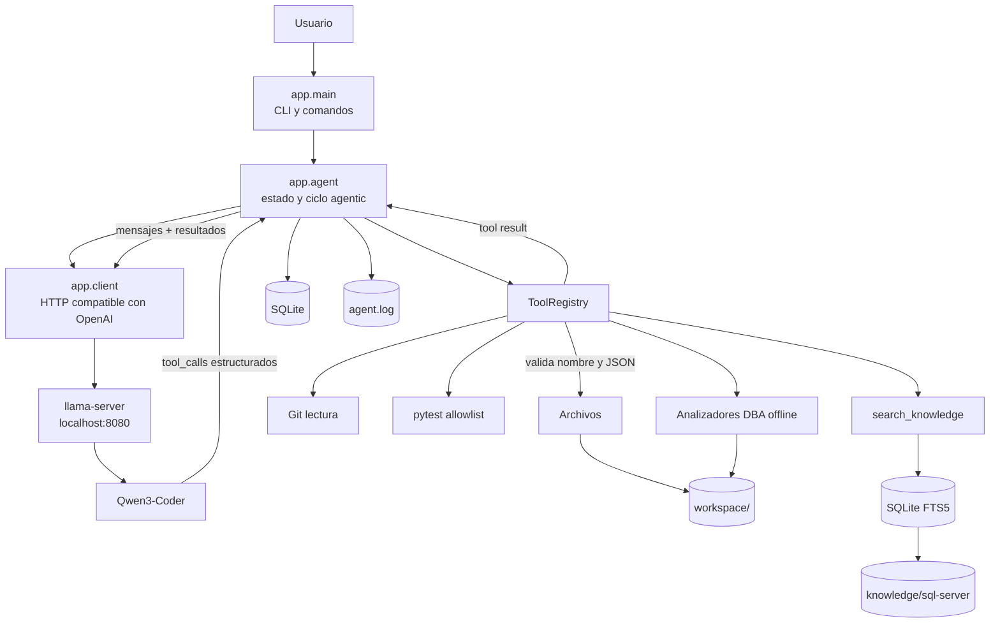
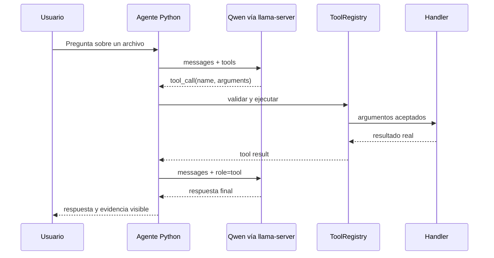

# Arquitectura

Este documento describe las responsabilidades internas. Para una vista general, consulta el [README](../README.md).

## Componentes y límites de confianza



La frontera principal está entre el texto generado por el modelo —no confiable— y `ToolRegistry`. Un tool call no otorga autoridad por sí mismo: el registro decide si el nombre existe, valida argumentos y ejecuta un handler fijo.

## Responsabilidades

| Módulo | Responsabilidad |
|---|---|
| `app/main.py` | Bucle interactivo y comandos `/info`, `/help`, `/history`, `/clear`, `/dba`, `/knowledge`, `/exit` |
| `app/agent.py` | Historial, rondas de herramientas, eventos y gate de analizadores según artefactos explícitos |
| `app/client.py` | `/v1/models`, `/v1/chat/completions`, timeouts y validación de respuestas |
| `app/config.py` | Rutas, límites, identidad y ubicación del system prompt |
| `app/prompts/dba_system.md` | Política y especialización DBA versionada |
| `app/knowledge.py` | Indexación y retrieval léxico SQLite FTS5 |
| `app/models.py` | Tipos internos para respuestas y tool calls |
| `app/memory.py` | Persistencia SQLite por `session_id` y censura básica |
| `app/logging_config.py` | Rotación y formato de logs |
| `app/tools/base.py` | Registro, esquema OpenAI y validación de argumentos |
| `app/tools/files.py` | Operaciones seguras dentro del workspace |
| `app/tools/git_tools.py` | `git status` y `git diff` sin mutaciones |
| `app/tools/test_tools.py` | Ejecución de pytest mediante allowlist |
| `app/tools/dba.py` | Parsing seguro de IO, TIME, sqlplan y deadlock XML |

## Secuencia de una herramienta



## Separación operativa

- El agente es interactivo y se inicia manualmente como usuario normal.
- Solo `llama-server` es persistente y está administrado por systemd.
- El servicio usa el usuario sin shell `llama`; no comparte privilegios con el cliente.
- El modelo y el runtime están fuera del repositorio y el GGUF está excluido por `.gitignore`.
- SQLite y logs son datos de ejecución locales, también excluidos de Git.
- El corpus DBA es texto versionado y auditable; el índice FTS5 generado vive en `data/` y no se versiona.
- Los analizadores DBA no abren conexiones de base de datos: solo procesan texto o archivos autorizados del workspace.

## Estructura resumida

```text
ai-agent/
├── app/
│   └── tools/
├── deploy/
├── evals/
├── knowledge/sql-server/
├── docs/
├── tests/
├── workspace/
├── requirements.txt
├── pytest.ini
└── README.md
```

Consulta también [Tool calling](tool-calling.md), [Seguridad](seguridad.md) y [Decisiones](decisiones.md).
